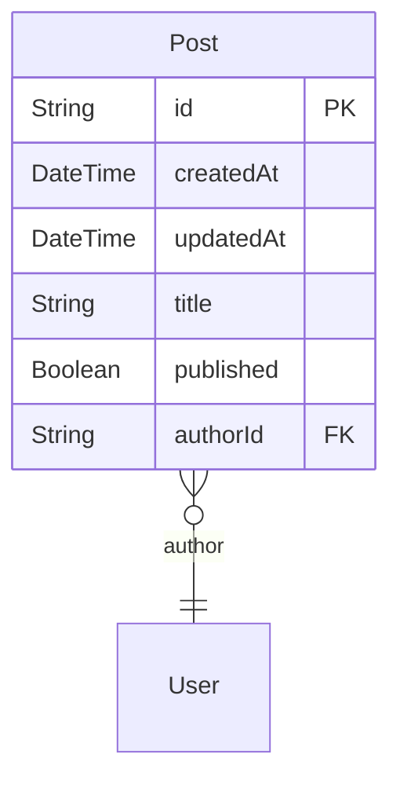
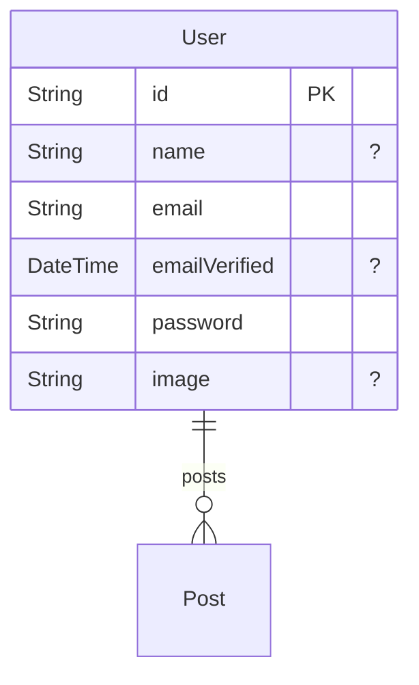

# ZenStack Markdown Plugin

ZenStack Markdown Plugin is a standard plugin of [ZenStack](https://github.com/zenstackhq/zenstack) to generate markdown from the ZModel schema with Mermaid ERD diagram.

Do you know the Mermaid's official SaaS product, [MermaidChart](https://www.mermaidchart.com/), is powered by ZenStack？😉

## Example

-   [Post](#Post)
-   [User](#User)

### Post



-   CREATE
    -   ✅ auth() == author
-   READ
    -   ✅ auth() == author
    -   ✅ auth() != null && published
-   UPDATE
    -   ✅ auth() == author
-   DELETE
    -   ✅ auth() == author

### User



-   CREATE
    -   ✅ true
-   READ
    -   ✅ true
-   UPDATE
    -   ✅ auth() == this
-   DELETE
    -   ✅ auth() == this

## Setup

```bash
npm i -D zenstack-markdown
```

add the plugin in your ZModel schema file

```ts
plugin zenstackmd {
    provider = 'zenstack-markdown'
}
```

run zenstack generate

```bash
npx zenstack generate
```

you will see the `schema.md` generated in the same folder of your ZModel schema file.

## Options

| Name     | Type    | Description                                       | Required | Default   |
| -------- | ------- | ------------------------------------------------- | -------- | --------- |
| output   | String  | Output file path (relative to the path of ZModel) | No       | schema.md |
| disabled | Boolean | Whether to run this plugin                        | No       | false     |

example:

```ts
plugin zenstackmd {
    provider = 'zenstack-markdown'
    output = 'docs/schema.md'
    disabled = true
}
```

You can also disable it using env variable

```bash
DISABLE_ZENSTACK_MD=true
```

## Local Development

### Install

```bash
npm install
```

### Build

```bash
npm run build
```

After build, the plugin will be generated in `dist` folder. Then you can use it in your existing ZModel schema by setting the `provider` this `dist` folder

```ts
plugin zenstackmd {
    provider = '.../zenstack-markdown/dist'
}
```

`provider` could either by the absolute path or relative path to the running `zenstack` module.

### Run Sample

simply run `npm run dev` to see a more complicated result [schema.md](./schema.md) generated from [schema.zmodel](./schema.zmodel)

## Show Mermaid Diagrams in Markdown

-   GitHub

    Supported by default

-   VSCode

    Install this extension [Markdown Preview Mermaid Support](https://marketplace.visualstudio.com/items?itemName=bierner.markdown-mermaid)

-   Other Unsupported Places

    Install the mermaid-cli:

    ```bash
    npm install -g @mermaid-js/mermaid-cli
    ```

    Transform the markdown file with mermaid diagrams

    ```bash
    mmdc -i schema.md -o schema-svg.md
    ```

    The mermaid-cli will find the mermaid diagrams, create SVG files from them and refer to those in the markdown output.
