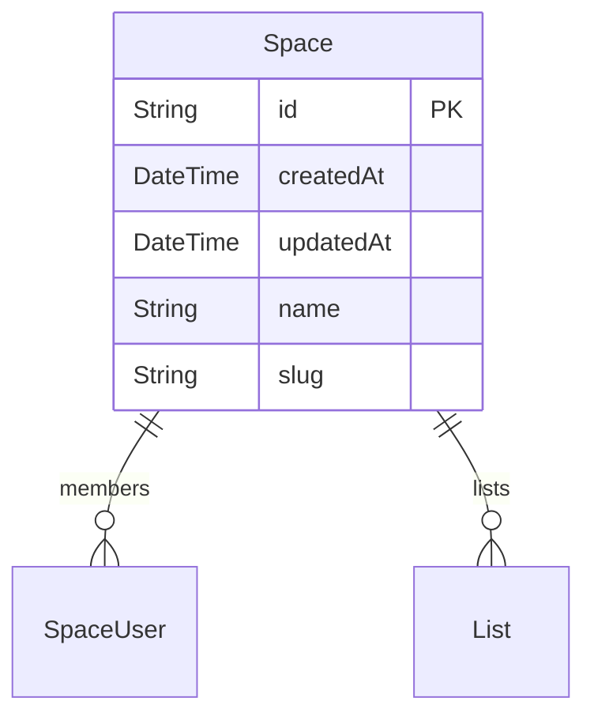
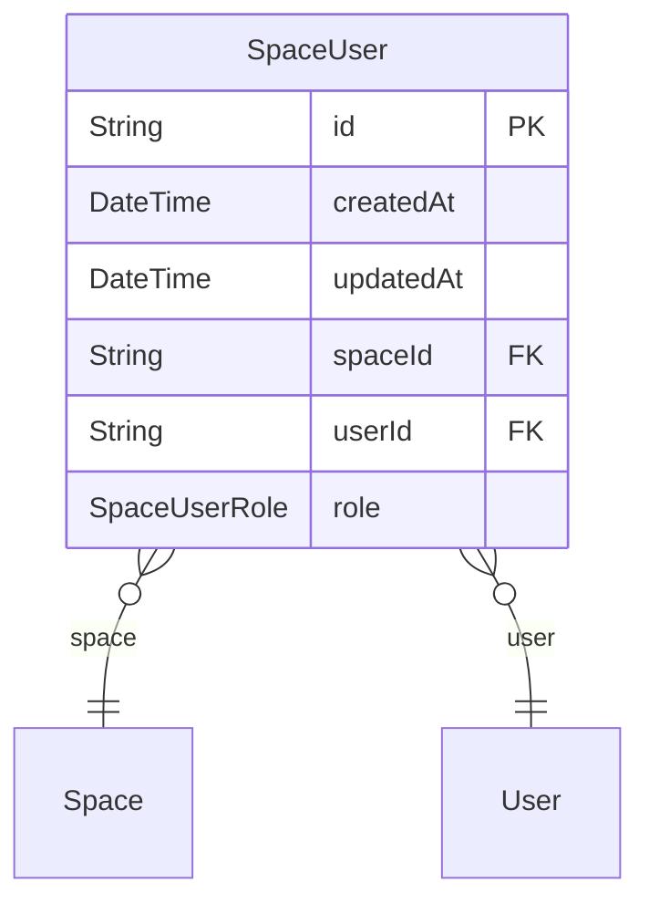
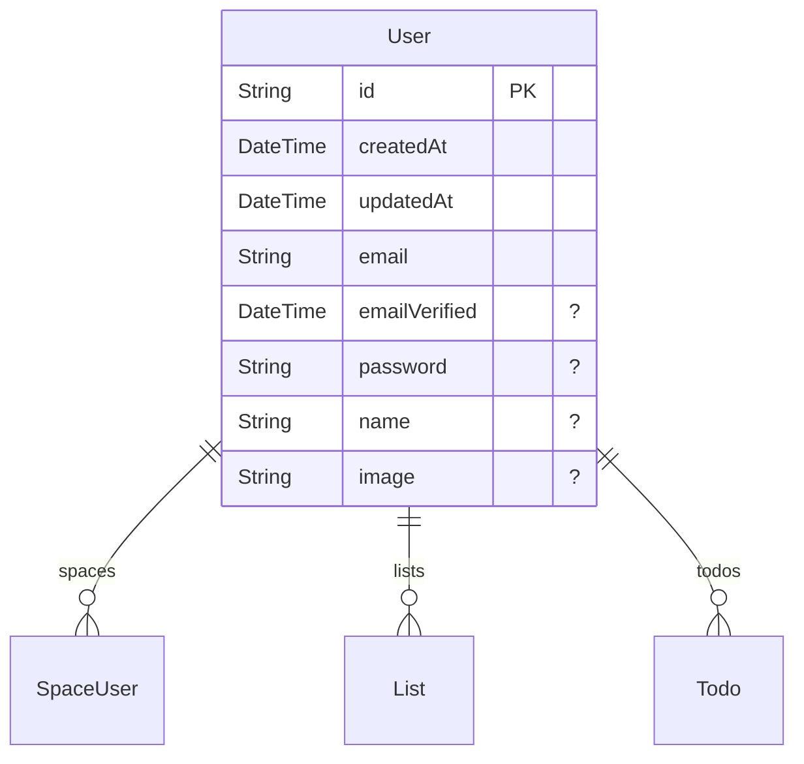
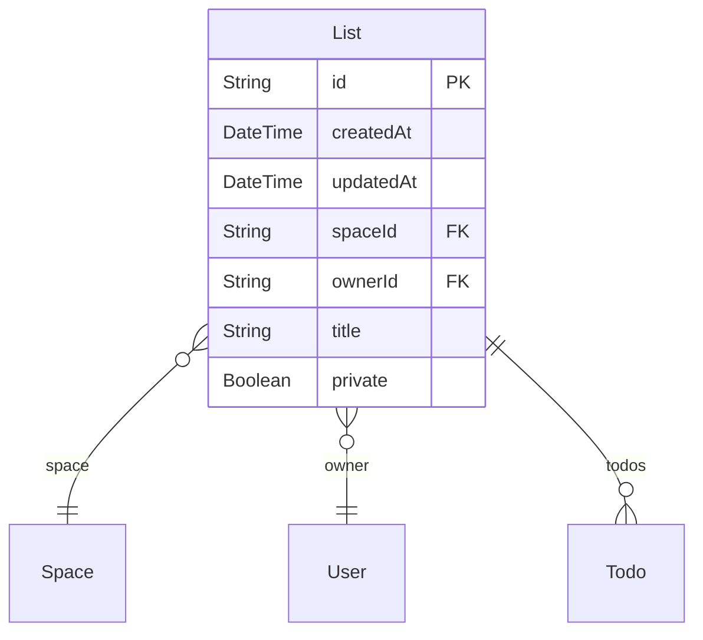
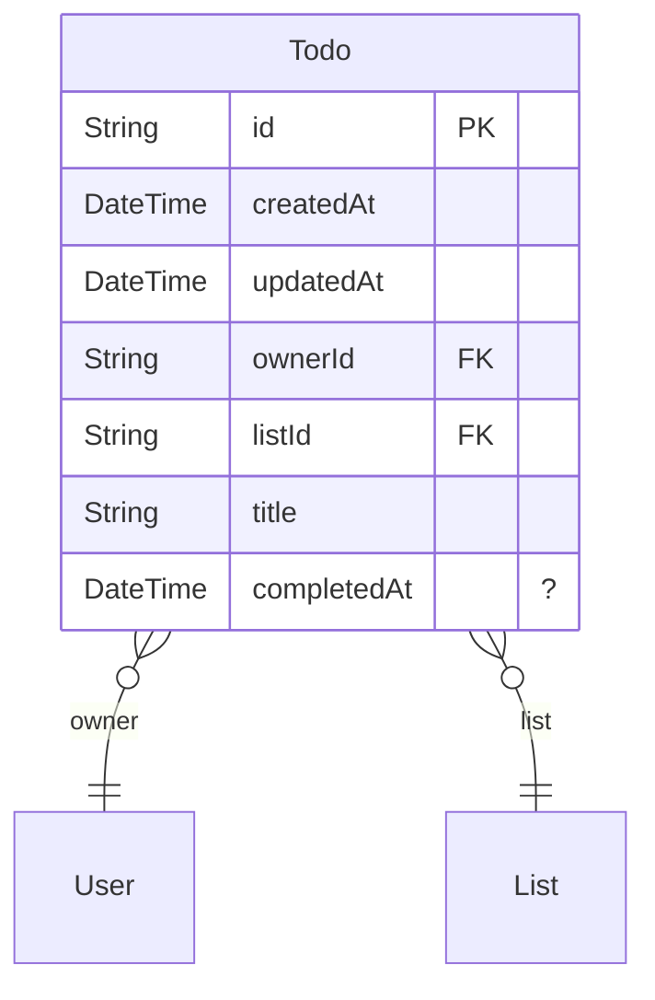

# ZModel

> Generated by [`ZenStack-markdown`]((https://github.com/jiashengguo/zenstack-markdown))

- [Space](#Space)
- [SpaceUser](#SpaceUser)
- [User](#User)
- [List](#List)
- [Todo](#Todo)

## Space

- CREATE
  - ❌auth() == null
  - ✅true
- READ
  - ❌auth() == null
  - ✅members ? [user == auth()]
- UPDATE
  - ❌auth() == null
  - ✅members ? [user == auth() && role == ADMIN]
- DELETE
  - ❌auth() == null
  - ✅members ? [user == auth() && role == ADMIN]
## SpaceUser

- CREATE
  - ❌auth() == null
  - ✅space.members ? [user == auth() && role == ADMIN]
- READ
  - ❌auth() == null
  - ✅space.members ? [user == auth()]
- UPDATE
  - ❌auth() == null
  - ✅space.members ? [user == auth() && role == ADMIN]
- DELETE
  - ❌auth() == null
  - ✅space.members ? [user == auth() && role == ADMIN]
## User

- CREATE
  - ✅true
  - ✅auth() == this
- READ
  - ✅spaces ? [space.members ? [user == auth()]]
  - ✅auth() == this
- UPDATE
  - ✅auth() == this
- DELETE
  - ✅auth() == this
## List

- CREATE
  - ❌auth() == null
  - ✅owner == auth() && space.members ? [user == auth()]
- READ
  - ❌auth() == null
  - ✅owner == auth() || (space.members ? [user == auth()] && !private)
- UPDATE
  - ❌auth() == null
  - ✅owner == auth() && space.members ? [user == auth()] && future().owner == owner
- DELETE
  - ❌auth() == null
  - ✅owner == auth()
## Todo

- CREATE
  - ❌auth() == null
  - ✅list.owner == auth()
  - ✅list.space.members ? [user == auth()] && !list.private
- READ
  - ❌auth() == null
  - ✅list.owner == auth()
  - ✅list.space.members ? [user == auth()] && !list.private
- UPDATE
  - ❌future().owner != owner
  - ❌auth() == null
  - ✅list.owner == auth()
  - ✅list.space.members ? [user == auth()] && !list.private
- DELETE
  - ❌auth() == null
  - ✅list.owner == auth()
  - ✅list.space.members ? [user == auth()] && !list.private