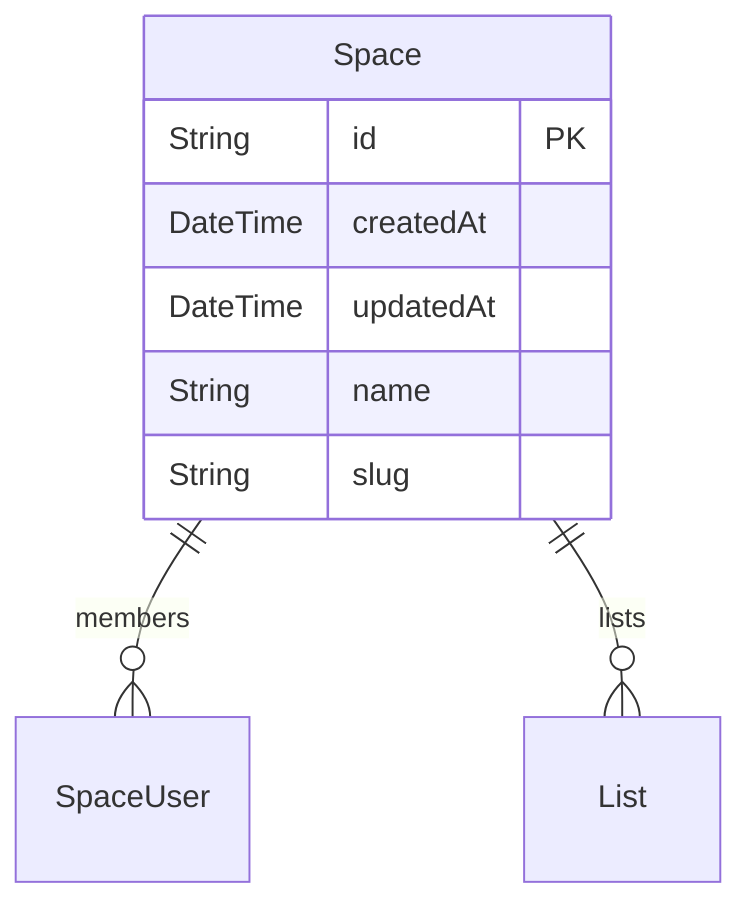
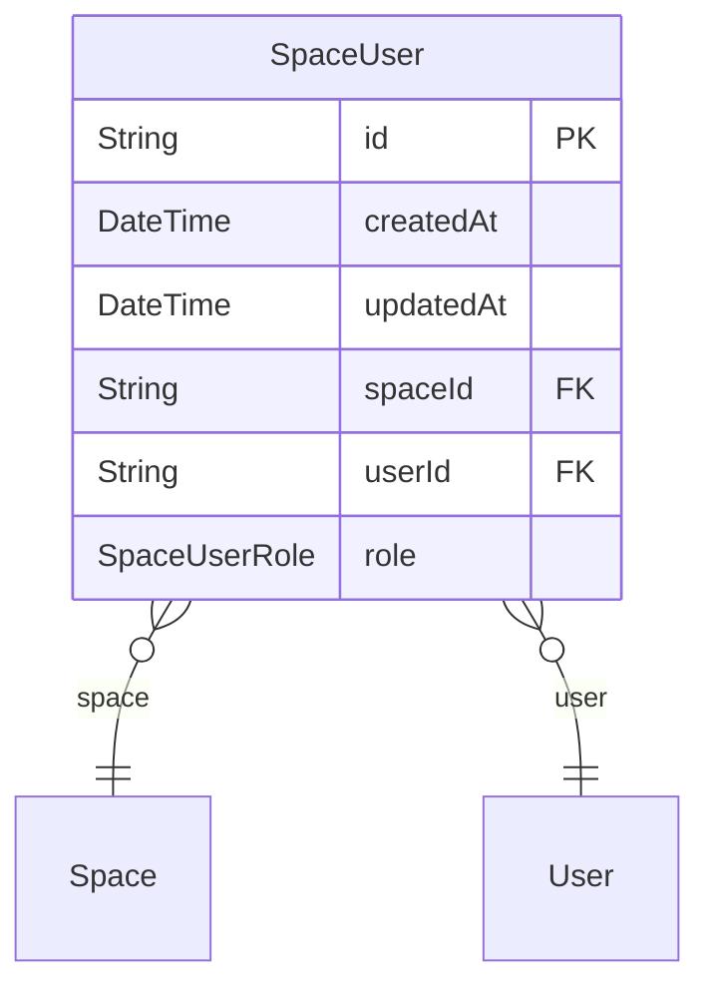
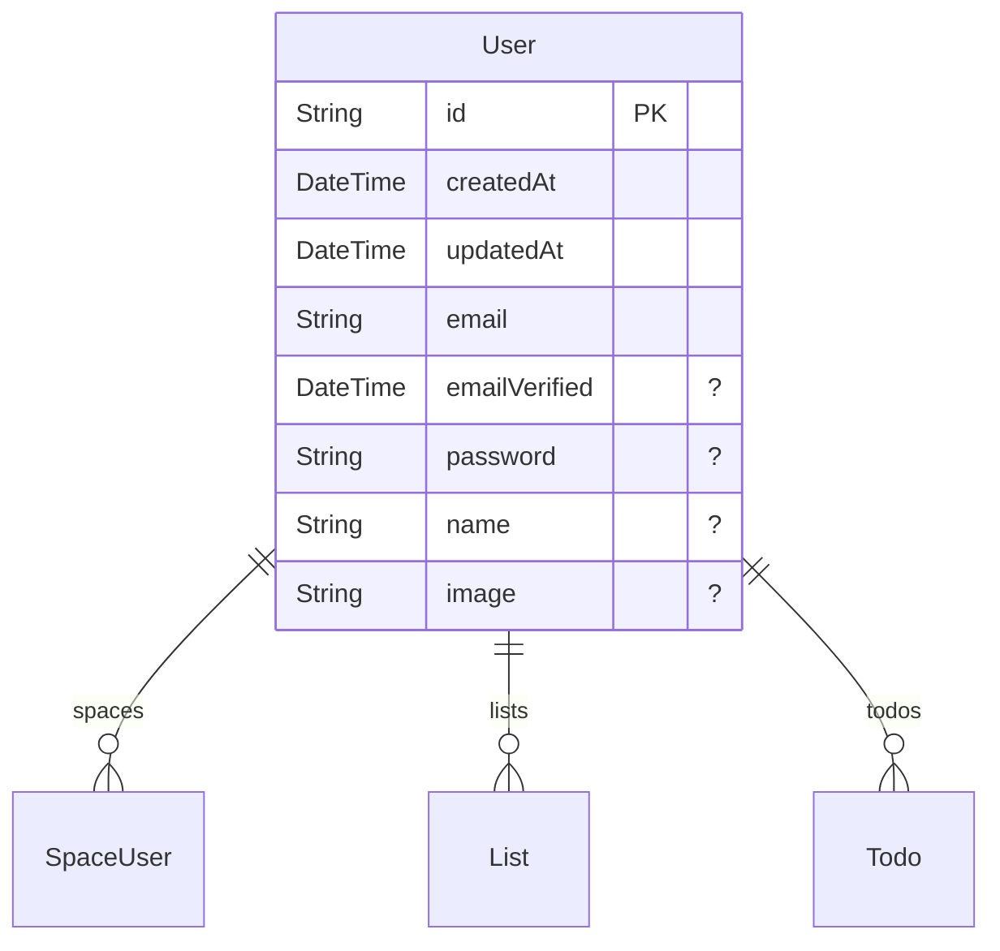
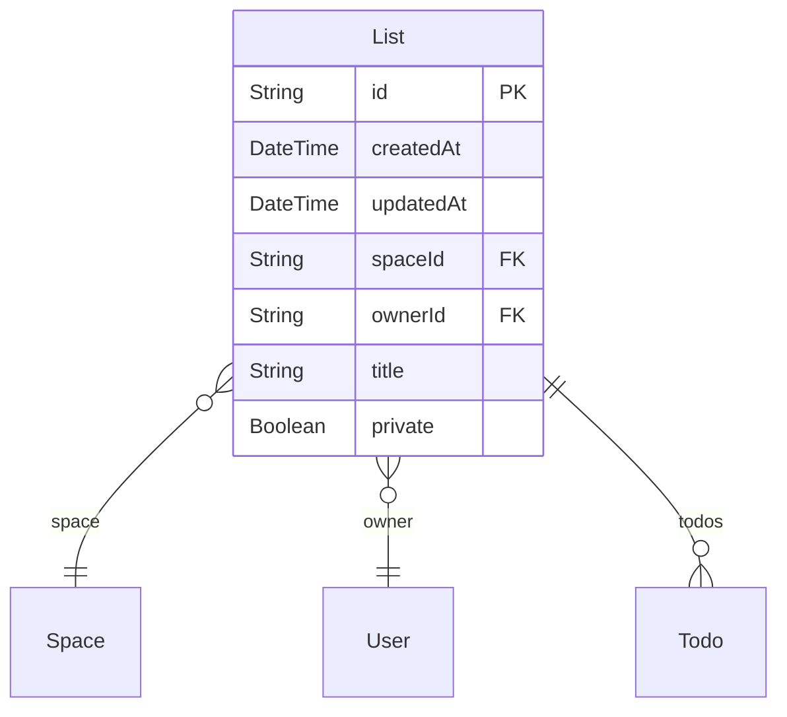
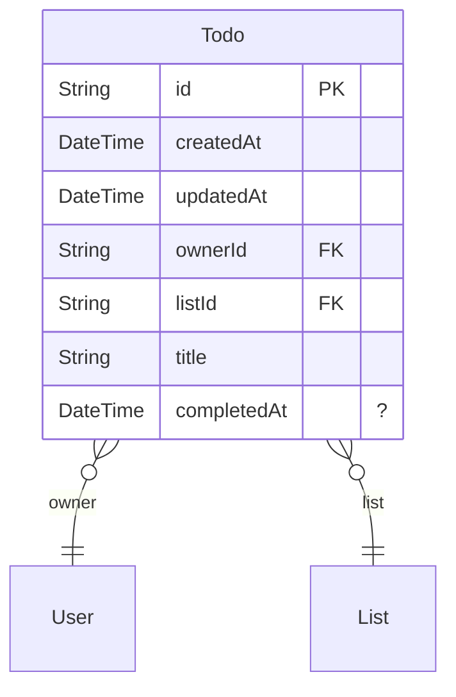

# Technical Design Document

> Generated by [`ZenStack-markdown`](https://github.com/jiashengguo/zenstack-markdown)

This application is designed to manage collaborative spaces where users can create and manage lists and todos within those spaces. It provides a structured environment for team collaboration, task management, and personal organization within a shared context.

## Functionality

The app allows users to:
- Create and manage personal and shared spaces.
- Invite members to spaces with different roles (USER or ADMIN).
- Create lists within spaces, which can be private or public.
- Add, update, and delete todos within lists.
- Control access to spaces, lists, and todos based on user roles and ownership.

## Models:

- [Space](#Space)
- [SpaceUser](#SpaceUser)
- [User](#User)
- [List](#List)
- [Todo](#Todo)

### Space

- Only authenticated users can interact with spaces.
- Anyone can create a new space.
- Users can read a space if they are a member of that space.
- Only admins of the space can update or delete the space.
### SpaceUser

- Only authenticated users can interact with space memberships.
- Admins of the space can create, update, or delete memberships.
- Members can read their own membership details.
### User

- Anyone can create a new user account.
- Users can read their own profile or profiles of members in spaces they belong to.
- Users have full control over their own profile.
### List

- Only authenticated users can interact with lists.
- Lists can be read by the owner or members of the space if the list is not private.
- Only the owner can create a list within a space they are a member of.
- The owner can update the list if they remain the owner after the update.
- Only the owner can delete the list.
### Todo

- Only authenticated users can interact with todos.
- Todos can be managed by the list owner or members of the space if the list is not private.
- The owner of the list can perform all operations on todos.
- Updates to todos are restricted to prevent changing ownership.